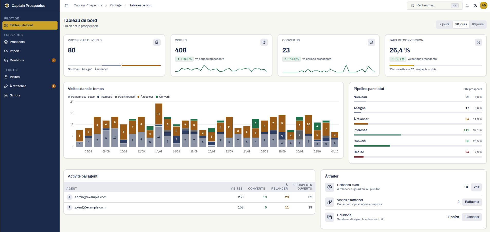
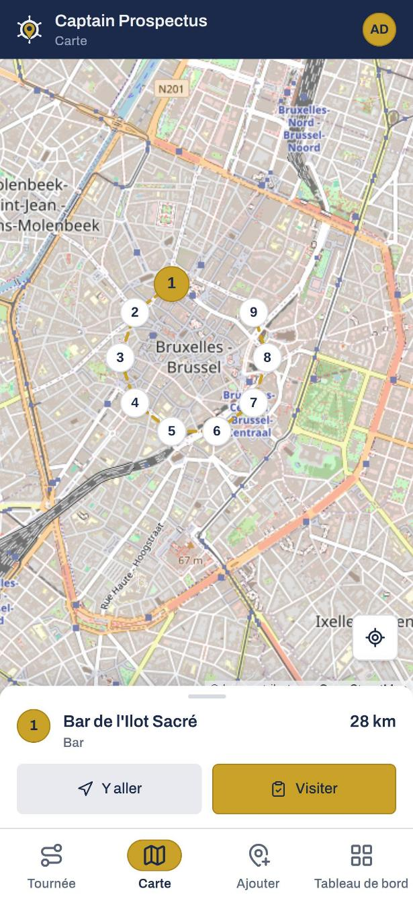

<h1 align="center"></h1>

B2B field-canvassing app. An admin imports restaurants and food trucks (CSV or a map area), assigns them to field agents, and watches visits arrive live. Agents work from a phone, offline-first: they walk their list, hand out flyers, run the question script, log the outcome, and add places they discover on the street.

<p align="center">
  <a href="https://react.dev/"></a>
  <a href="https://www.typescriptlang.org/"></a>
  <a href="https://vite.dev/"></a>
  <a href="https://workers.cloudflare.com/"></a>
  <a href="https://developers.cloudflare.com/d1/"></a>
  <a href="LICENSE.md"></a>
  <a href="https://join.captain.food"></a>
</p>

**Hard constraint: runs at zero cost.** See [ADR-0002](docs/adr/0002-zero-cost-constraint.md).

<p>&nbsp;&nbsp;</p>

## Status

M0 done: the app is scaffolded, CI runs lint, typecheck, tests and build, and the
sync endpoint works end to end against a local D1. Not yet deployed — the
Cloudflare account and Access application are set up by hand, see
[deployment](docs/deployment.md). Next: M1, prospects and CSV import.
See the [roadmap](docs/roadmap.md).

## Develop

```sh
pnpm install
cp .dev.vars.example .dev.vars
pnpm db:migrate:local
pnpm dev                 # then, in another terminal:
pnpm db:seed:local
```

The default seed holds 10 blank prospects, unassigned and never visited, plus the active script; the users are the admin and the agent of `.dev.vars`. For about 300 places and 180 days of visit history for two agents, so every figure on Tableau de bord has data, run `pnpm db:seed:local:full` instead. Running it again inserts nothing while the seeded prospects are unedited, but it merges an unmerged one again, and the dates stay those of the first run. For fresh dates, delete `.wrangler/state`, then run `pnpm db:migrate:local && pnpm db:seed:local:full` (never `--remote`).

## Where to start

| You want to… | Read |
|---|---|
| Understand the product | [docs/vision.md](docs/vision.md) |
| Understand the system | [docs/architecture.md](docs/architecture.md) |
| Understand the business rules | [docs/domains/](docs/domains/) |
| Know why something is the way it is | [docs/adr/](docs/adr/) |
| Deploy | [docs/deployment.md](docs/deployment.md) |
| Contribute (humans) | [CONTRIBUTING.md](CONTRIBUTING.md) |
| Contribute (AI agents) | [CLAUDE.md](CLAUDE.md) |

## Stack

Vite + React PWA · Hono on a single Cloudflare Worker · D1 (SQLite) + Drizzle · Dexie (IndexedDB) · Leaflet + OpenStreetMap/Overpass · Cloudflare Access.

## License

[AGPL-3.0](LICENSE.md)
